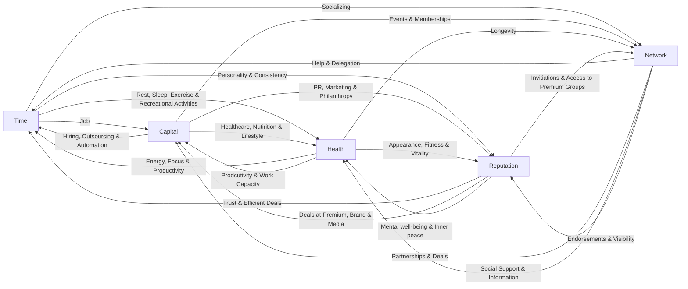
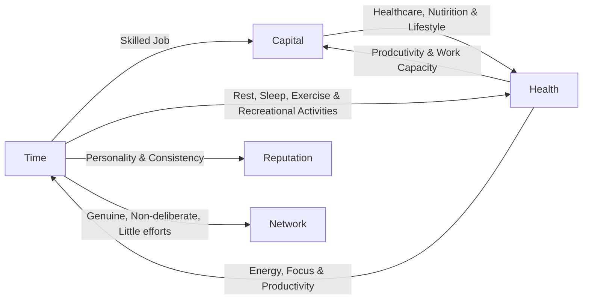
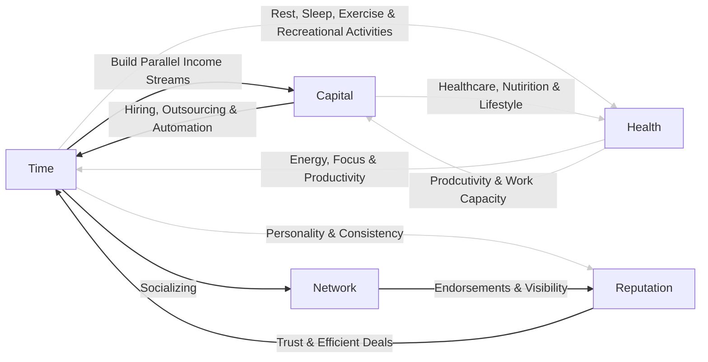
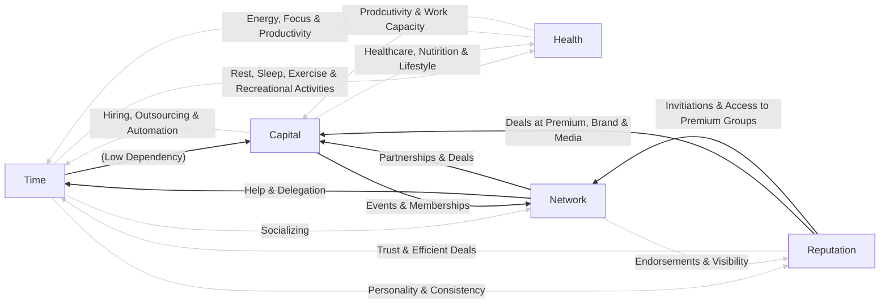
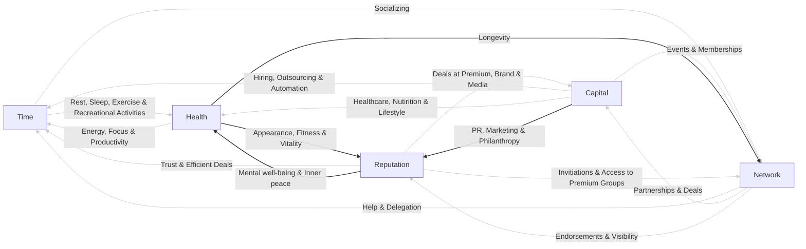
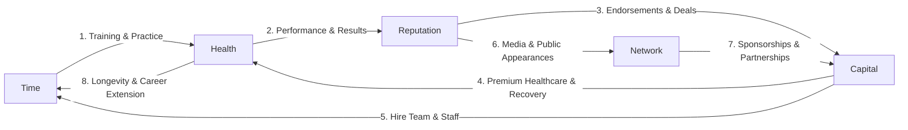
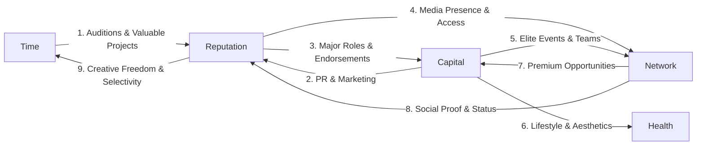
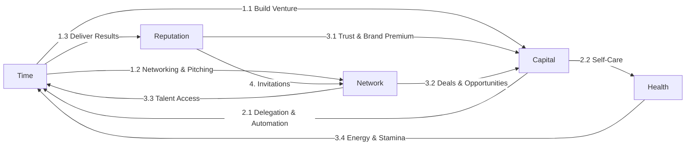

# The Great Game of Life

I had read somewhere that *in order to be good at something, treat it like a game.* My immediate thought was, *can I draw parallels between life and playing a strategy game?* I think maybe we can. The following analogy is by no means complete; we can keep adding details and draw finer and finer parallels to make the gameplan a better simulation of the reality. The actual purpose is to understand the high-level dynamics of the play, so that it enables us to devise a strategy to play this *great game* a bit better. I call this as **The Great Game of Life**.  Imagine a game in the same genre of *Civilization*, *Age of Empires* or *Clash of Clans*, but more complex and rewarding. Fortunately, there is a lot of wisdom that I happened to unlock due to this comparative study. 

Let's say the country in which you are born or choose to play becomes your map: a vast unpredictable playground where opportunities, constraints and competitors coexist. While you grow, you acquire a certain skillset *(via education)* to thrive in a particular kind of terrain. Each market or sector on the map is a kind of terrain with its own logic, strategy, difficulty, and rewards. You earn *resources* when you play wisely and lose when you don't. One of the most popular and commonly chased resource is *money* in this world, though it forms only one part of a large system of value. 

No one hands you the rulebook at the beginning. You learn by observing veterans, the players who have survived long enough to see the underlying mechanics, and by gaining experience yourself as you play along. Allow me to take you through each component of this game in slightly more detail. 

## The Map

The world is a patchwork of terrains. There surely would be at least one terrain where you will survive better than the others based on your skills & knowledge that you have acquired, and that's your *natural habitat*. Playing this game outside your *natural habitat* increases the difficulty unnecessarily and might diminish the quality of your play. Possible analogies of the terrains could be as follows. 

| Terrain Type | Features | Real World Equivalent  |
| --- | --- | --- |
| Mountains | Highly difficult to climb, requires specialized gear and high stamina, high risk of failure, high reward as the same height later prevents your competition from tapping in | Manufacturing, Energy, Infrastructure, Aerospace, Biotech, Pharmaceuticals, etc. |
| Forests | Opaque, unstructured, hard to navigate, the biospace where majority of the species live | Unorganized sector, Local services, etc. | 
| Plains | Fast moving, easy to traverse, low risk, competitive landscapes, scarce resources heavily contested by existing players | E-commerce, Retail, Consumption, Consumer Tech, etc. | 
| Deserts | Empty, mostly depleted resources, some oases within | Print media, call centers, etc. | 
| Oceans | Unknown & unexplored, the risk is navigation and creating your own currents, the first to chart a course claims immense value | New Categories like EVs in 2009, Crypto in 2016, AI in 2020, etc. | 

## The Game's Resources

Every player plays with *five* resources: ***time, capital, health, reputation,*** *and* ***network.*** 

We will define the game's *winning condition* more concretely by the end of this section, but in vague terms, the *goal* is to keep increasing all the five resources over a period of time, and *winning* happens when the composite score of all five resources is high. Having a very high value in one resource *(say capital)*, and very low score in other resources *(say health or reputation)* wouldn't satisfy the win condition. 

What makes this game interesting is that if you have one resource in excess, you can always trade it for another resource.

### Interconversion of Resources

It's in common knowledge of people that we convert *time* to *capital* by doing a *job*, or *capital* to *health* by affording better healthcare, higher quality nutrition, and better lifestyle, and so on. Some people also know that they can convert their *capital* to *time* by hiring people, outsourcing work or automation, or *network* to *time* by asking help or quickly getting things done by someone they know who could do it within your network. But little do people know that *all five resources are interconvertible!*

|    | Time | Capital | Health | Reputation | Network |
| --- | ---- | ------- | ------ | ---------- | ------- |
| **Time**    | - | Job | Rest, Sleep, Exercise & Recreational Activities | Personality & Consistency | Socializing |
| **Capital** | Hiring, Outsourcing & Automation | [Compounds via Investments] | Healthcare, Nutrition & Lifestyle | PR, Marketing & Philanthropy | Events & Memberships |
| **Health**  | Energy, Focus & Productivity | Productivity & Work Capacity | - | Appearance, Fitness & Vitality | Longevity | 
| **Reputation** | Trust & Efficient Deals | Deals at Premium, Brand & Media | Mental well-being & Inner peace | - | Invitations & Access to Premium Groups | 
| **Network** | Help & Delegation | Partnerships & Deals | Social Support & Information | Endorsements & Visibility | - |

Before we get into the nitty-gritty details of these interconversions, we should reinforce our understanding of each of the resource. 

### Characteristics of Resources

#### 01. Time

| | |
| --- | --- |
| **Nature** |  It is the only non-renewable resource. You can compound capital, rebuild health, repair reputation, and expand your network; but you can't buy back a single minute. It's the most symmetrically distributed resource: everyone gets 24 hours. Its rate is constant: everyday it passes at the same rate. You can't control its flow. |
| **Risk** | Spending time on things that don't compound: bureaucracy, low-leverage work, or status games. |
| **Symptoms of Shortfall** |  Burnout, backlog, feeling trapped. |
| **Recovery** | Impossible to recover your own time. You can only allocate future time better. Trade capital for time (hire, automate). Ruthlessly prioritize leverage. Don’t trade health or reputation for it; that’s debt you can’t repay.|
| **Paul Graham's Insight** | Most people spend time as if it renews daily, like sunlight. It doesn’t. It only appears infinite because you haven’t yet seen the total sum of what’s left. |
| **Naval's Insight** | Spend time on things that scale: code, technology, media, relationships, and ideas. |

#### 02. Capital

| | |
| --- | --- |
| **Nature** | It's the most liquid resource that can be converted to other resources very efficiently. It expands non-linearly with leverage and linearly without it.  |
| **Risk** | Capital loses its value with poor deployment. Pursuing capital at the cost of other resources leads to collapse: burnout, distrust, isolation. |
| **Symptoms of Shortfall** |  Anxiety, financial stress, scarcity mindset.  |
| **Recovery** | Trade time for capital, but through *skills* and not labor. Work in an area which you can scale it later. Avoid trading reputation (e.g., quick money schemes); the damage is irreversible. |
| **Paul Graham's Insight** | You create capital when you make stuff that people want, provide it to them efficiently and at scale.  |
| **Naval's Insight** | Use capital to buy leverage, not things. Use it to escape the treadmill, not decorate the cage.  |

#### 03. Health

| | |
| --- | --- |
| **Nature** | It's the *rate limiter* of all other conversions. When health drops, every other resource generation stalls. The machinery works as long as this resource doesn't fall below a certain threshold. |
| **Risk** | It declines exponentially if neglected and only alarms after it is damaged beyond repair. Time becomes pain, not productivity. |
| **Symptoms of Shortfall** |  Fatigue, chronic stress, low immunity, frequent illness. |
| **Recovery** | Trade time and capital for health through nutrition, healthcare and rest. Don't overtrade capital: health isn't for sale; it's cultivated. |
| **Paul Graham's Insight** | Your body is the most complex system. Bugs at one place cascade everywhere.  |
| **Naval's Insight** | Treat health as infrastructure. You don't notice it until it fails; then it's all that matters. |

#### 04. Reputation

| | |
| --- | --- |
| **Nature** | It's the slowest growing, most asymmetric, non-linear, and most fragile resource. It takes decades to grow, not everyone has it, provides amazing returns after it has grown substantially *(like leverage)* and can be lost in an afternoon. |
| **Risk** | Once broken, it requires massive investment of time and capital to rebuild. |
| **Symptoms of Shortfall** | Isolation from others, people distrust, & opportunities stall.  |
| **Recovery** | Takes long-term authenticity and consistent alignment between word and action. Admit mistakes. Overdeliver quietly. Don't rush to buy it with PR; that's painting rust. Use capital to convert it to reputation at the later stages[^1]. |
| **Paul Graham's Insight** | Your reputation is the checksum of your behavior over time. If you are a good person, your reputation over a long period of time will turn out to be good. If that's not the case, your behavior over time has been bad. Reputation is the report card of the behavior. |
| **Naval's Insight** | Be so reliable that the world pre-commits to your future. Reputation is permissionless leverage. |

#### 05. Network

| | |
| --- | --- |
| **Nature** | It grows geometrically when one has positive-sum behavior. It also provides non-linear returns after the network has grown substantially. |
| **Risk** | Network is not the number of people you know. Network is the number of people who are willing to help you when asked, people who support you and root for you. When connections are made with interest or agenda, the network decays. |
| **Symptoms of Shortfall** | Limited perspective, loneliness despite too many people being around, lack of opportunity flow, poor luck. |
| **Recovery** | Networks can be bought but they are short-lived. Long-term networks are built when you connect with people via curiosity and shared interests. |
| **Paul Graham's Insight** | The best networks form around doing interesting things with smart people. |
| **Naval's Insight** | Build relationships that outlast your startups. One of the metrics of success is being a kind of person others would want to bet on twice. |

### Interconversion Channel Efficiency

Now that we know the characteristics of each resource, and every resource can be converted to other four resources, the question is: *are all conversions equally efficient and viable?* Suppose I want *reputation*, so what is the most efficient way to build it? Should I trade *time* and build it long term with my personality and consistency? Or should I use *capital* *(assuming I have it enough)* and build it via PR or philanthropy? Or should I leverage my network and ask people who have built decent reputation to endorse me? Basically, I want to understand *what works best and what doesn't*.  

|    | Time | Capital | Health | Reputation | Network |
| --- | ---- | ------- | ------ | ---------- | ------- |
| **Time** | - | ***Low → High:*** From labor *(low)* to professional work *(medium)* to high-leverage work *(code, media, products, technology)*. | ***High***: Good sleep, exercise, cooking healthy food, and recreation is non-negotiable. | ***Very High:*** The most authentic path to durable reputation. | ***Medium:*** Genuinely giving time and help without immediate expectations build real bonds, but results are uncertain. |
| **Capital**    | ***High***: Hiring, outsourcing, and automation can be one of the best uses of capital. | - | ***High***: Buys better healthcare, nutrition, safer environments, and better lifestyle. However, the returns are conditional to good sleep and exercise. | ***Low***: Capital buys PR, marketing, and philanthropy which creates popularity and visibility, but rarely the core asset of *trust*. ***Medium***: Slightly efficient in later stages, when needed to amplify the already-earned reputation. | ***Low***: Buys access to events and memberships, but not genuine connection or loyalty. Networks built on capital vanishes when capital dries up. |
| **Health**     | ***Very High:*** One focused hour beats three tired ones. | ***High:*** Good health multiplies productivity and earning potential. | – | ***Low***: Appearing fit, energetic and young contributes to the reputation of discipline and perhaps reliability, but it's a weak second-order effect. | ***Medium:*** Health helps in maintaining a network. Chronic health issues often lead to social isolation. However, being healthy alone doesn't necessarily create networks. |
| **Reputation** | ***High***: A strong reputation for competence and integrity makes deals and collaborations more efficient. Less time is wasted on negotiations, vetting, and bureaucracy. | ***Very High***: A strong reputation allows you to command premium prices, attract better deals, and get access to opportunities that are not available to others. | ***Medium to High***: A good reputation and the mental peace that comes with it reduce stress and anxiety, which are major contributors to poor health. This is an underappreciated but vital link. | - | ***High***: A strong reputation is a magnet. People want to connect with those they admire and trust. Your reputation precedes you and opens doors to high-quality networks. | 
| **Network** | ***Medium***: This is the *"I know a guy"* effect for solving problems quickly, but the willingness and availability of *the guy* is always a bottleneck. | ***High***: Your network is a primary source of deals, partnerships, and investment opportunities. The *"network effect"* on capital is often non-linear. | ***Low***: Social connections provide emotional support and valuable information, but that's rarely the missing link. People need *time*, *capital* and *mental well-being* to be healthy. | ***High***: Earned endorsements and visibility from a trusted network are incredibly powerful. A recommendation from a respected person is worth more than a thousand ads. | - |

### Phase Dynamics of Interconversions

I know you'd have probably guessed by now that the right strategy for *the great game of life* would involve focusing more on the efficient interconversion channels. However, one cannot take the advantage of a conversion channel at will. For example, one cannot decide in their 20s to convert *reputation* to *capital*, unless they've built that channel. Most people have bankable reputation during their 40s. It is exactly the same time when people try to reduce their dependence on converting *time* to *capital* because work-life balance is the priority then. I'm hinting that the viability of these channels *(the dynamics)* is different in 20s, 30s and 40s *(phases of life)*. 

A sample strategy of play could be as follows. 

#### Phase 1. The 20s

At this stage, your best resources are *time* and *health*. You perhaps don't have *capital*, *reputation* and *network*. 

**Ideal Play:** You decide to convert your *time* to *capital* via professional or high-leverage work. *Health* is a very important long-term asset, so you give yourself enough time for rest, sleep, exercise and other recreational activities. You realize that it takes years to build strong reputation, so you start early. You invest your *time* and build it consistently via your personality. It's okay to not socialize a lot and invest *time* to build networks. Maybe a few friends and a loving partner would be all that you'll need for at least a decade or so. Whatever *capital* you earn, you invest a good amount of it on your health: you eat good & clean food, live a better lifestyle, etc. This enhanced *health* would save your *time* and *capital* by making you more productive.    

**Some Common Pitfalls** 

1. You should not convert *time* to *capital* via labor *(blue collar jobs)*, because you wouldn't make enough capital to sustain your health or save enough to utilize capital in future to earn time and attain financial freedom. 
2. Investing too much of *time* in building poor quality *networks* because of hidden agendas, fake personas, status games, etc., and little in making *capital*, *health* and *reputation*.   
3. *Time* and *health* are the only two assets majority people have in 20s. Picking up unhealthy habits like alcohol, smoking, not getting enough sleep, eating junk food, neglecting health, etc., will cost a lot. It directly impacts the ability to work and the loop worsens. 
4. Trying to make *capital* too early from *reputation* or *network*, without building them in sizeable amount first.

#### Phase 2. The 30s

You now have skills and some capital. Depending on the risk taking abilities, you can shift your goals from earning to multiplying. You start figuring out how to turn one unit of effort into several units of output. Your objective should be to build the systems that earn when you rest and slowly your reputation should get recognized within your circle. 

**Ideal Play:** You continue to take care of your *health* and maintain the previous strategy. You start to experiment and invest your *time* in building parallel income streams. This often requires deploying *capital* at risk for some business idea or buying returns-yielding assets. You should start investing your *time* now in socializing and building *high-quality network*. Use this network to pump your *reputation* via endorsements and visibility. Do not try to encash the benefits in *capital* too early. Start taking advantage of your *reputation* to get efficient deals. 

**Some Common Pitfalls**

1. The capital should be spent on experiments in creating *value* and parallel income streams. People often spend up this capital early on for luxurious or above the means lifestyle. Some spend this capital to buy access/memberships to exclusive events and clubs. This kind of *network* is not healthy and short-lived. 
2. Trading health for faster capital gains has been common pattern. 
3. You will start to feel that you have a decent reputation in the system and your network is also growing. While you may reap some capital returns from it, but that shouldn't be the priority. It would only hamper the quality of network. Try to gain other non-capital benefits to begin with. 

#### Phase 3. The 40s

If you've played this game right for this long *(almost 2 decades)*, it's time to take advantage of your *reputation* and *network*. Your objective should be to convert *trust* into *freedom*; build teams, platforms, and people who outlast you; and simplify most of your decision-making processes. 

**Ideal Play:** In an ideal scenario, you should now feel that you have enough *time*, because your dependency on the *time-to-capital* conversion is lowering. You start saving *time* by utilizing your network, and you start to reap *capital* benefits from *reputation* and *network*. You can reinvest this capital strategically into events, memberships, etc., to get you into certain groups which can put you in better position to get even further *capital* returns. 

**Some Common Pitfalls**

1. Getting into wrong groups, saying *yes* too often to people, ego-driven decisions, and picking up any other vice traits that erodes *reputation*. If this happens, the *capital* benefits shall stop and one might have to reluctantly depend more on *time-to-capital* conversion. 

#### Phase 4. The 50s

You have sufficient *capital*, *reputation* and *network*. Your objective here should be to transcend ownership: move from player to mentor. Help others play their own resource game better. Finally, preserve balance among all five and create a *self-feeding network*.

**Ideal Play:** Interestingly, at this stage, your *time* now gets spent only on your *health* and *socializing*. By now, you should have completely eliminated the need to work for money. Your other resources and systems that you built before are enough to feed to your *capital*. You can now invest your capital to amplify the reputation you've built. This enhanced reputation would only reap benefits. You can also start taking advantage of your appearance, fitness and longevity at this age. 

**Some Common Pitfalls**

1. Clinging to control instead of empowering others. 
2. Losing curiosity and neglecting societal changes. People tend to become too rigid and discard any kind of transformation. 

We are now in a better state to understand the *win-condition* of this great game. 

### The Win Condition

In any game, the *win condition* is defined as the specific, predefined objective that, when achieved, ends the game and designates a player or team as the winner. It's the ultimate goal that all strategy and tactics are directed toward. In chess, it's checkmating the opponent's king. In soccer, it's scoring more goals than the opponent by the end of the match. In monopoly, it's driving all other players into bankruptcy. 

In *The Great Game Of Life*, the win condition happens to be *to create a self-sustaining self-balancing self-feeding interconversion network of resources.* 

### Winning Strategies as Career Paths

In reality, there are multiple strategies that let you achieve this *win condition*. Knowingly or unknowingly, when people opt for different career paths, what they are doing is picking up a strategy to get to the *win condition*. 

#### The Athlete

At their core, athletes invest their *time* and whatever little *capital* they have into rigorous training, which directly builds their *health* and skill. This superior *health* and skill then produces winning performances, which builds their *reputation*. A strong *reputation* unlocks endorsements and deals, generating substantial *capital*. This *capital* is then used to preserve their most valuable asset: their *health*, through premium care, and to buy back *time* by hiring a support team. Simultaneously, their *reputation* grants them a wider *network* through media, which in turn attracts more sponsorships and *capital*, while their maintained *health* ensures long-term *time* to sustain this virtuous cycle.

**Common Failure Mode**: Trading health recklessly for short-term fame or money. Once health crashes, the game ends prematurely. Others rely overly on their short career span between 18-35 years. They fail to leverage capital, network, & reputation to make a sustaining business or alternate *capital-earning plan*. 

#### The Movie Star / The Celebrity

The aspiring star invests their *time* in honing their acting prowess and auditioning for roles that would get them quick exposure. Their primary goal is to build *reputation* and once built, it becomes their breakthrough asset attracting major projects and endorsements that generate substantial capital. This capital is then used to aggressively expand their *network* and to protect their *reputation* through strategic PR. Simultaneously, their strong *network* provides them direct access to better opportunities which multiplies their *capital* and *reputation* further. Eventually, it's again the *reputation* that buys them the ultimate luxury: freedom of time and creative choice. 

No wonder as *star kids* belong to wealthy families, they invest heavily in PR and networks very early on, because they understand how important *reputation* is in this profession. That's the unfair advantage they hold compared to an outsider!

**Common Failure Mode**: Some celebrities focus too much on visibility that gives fame but not enough reputation. Putting themselves out in public means leading a risky life where one irresponsible act can tarnish their reputation in an instant. Others fail because they feel emotionally depleted from lack of private time or health neglect. 

#### The Entrepreneur

The Entrepreneur is one of the few full-spectrum players who try to convert *time* to all other resources at once. They invest all their time directly into building a venture, which simultaneously generates early *capital*, builds a specialized *network*, and lays the foundation for their *reputation*. This initial capital is immediately reinvested to fuel growth, and often *health* is neglected. Once they achieve scale and a liquidity event, they strategically pivot: they use their substantial *capital* to buy back their *time* through delegation and automation, and to repair and protect their *health*. Their hard-earned *reputation* and *network* then begin paying massive dividends, creating a powerful flywheel where trust and connections attract superior deals, talent, and opportunities, making the entire system almost autonomous considerably early and freeing them to focus on the next grand vision.

**Common Failure Mode**: Apart from the business reasons, entrepreneurs fail when they treat their stamina as infinite, trade health and relationships for capital, and chase hype & reputation too early.  

 
In simple words, each career path banks on a different primary resource. The winning strategy often involves learning when to stop doubling down on your primary resource and start converting sideways to other resources. The trap is over-optimizing the fastest variable. Athletes overtrain, entrepreneurs overwork, movie stars over-chase reputation, etc. All lose the other slowly growing resources. 

## The Players

We don't play *the great game* solo. There are so many other players playing with us, and we interact with many other players during our play. I feel all players can be majorly categorized into *four* kinds. 

1. **The Pioneers**: These are the *explorers*. For example: entrepreneurs, athletes, movie stars, celebrities, CEOs, investors, etc. They take asymmetric bets, walk into uncharted terrains, and create maps & systems which others will use later. The risk is high, but so are rewards. They are famous for their problem-solving, systems-building, persuasion and pattern-recognition skills. 

2. **The Followers**: These are the *specialists*. For example: corporate employees, managers, professional workers, etc. They prefer stability and progression on well-known terrains. The risk is low, and the rewards are linear. They are famous for their execution skills and depth of their craft. 

3. **The Regulators**: These are the *rule-setters*. These are the politicians. They can change the physics mid-game (tax rules, policies, infrastructure). They can buff certain terrains (e.g. EV incentives, PLI schemes) or nerf others (e.g. regulations over alcohol, real-money gaming & so on).  

4. **The Missionaries**: These are the *non-profits.* For example: Non-profit organizations, charity organizations, etc. They play to change terrain quality rather than earn points. Their mission is to improve the playing conditions for everyone. 

## Final Takeaway

*The Great Game of Life* is too vast and complex. We can talk for hours/days/perhaps months on the dynamics of resource interconversions, how players influence each other, the meta-mechanics *(invisible rules)* of the game, the optimal pathways to reach the *win condition*, and so on. 

If we discuss ways to convert *time* to *capital*, we can go into the depths of various professions and career options that we have in the modern society. If we discuss, how to handle *capital* once we have it? And depending upon the amount of *capital* being talked about, we can go into various branches of *finance*. What should one do once they have a network? This brings us to the idea of *social skills*. How to build reputation? This will certainly touch the areas of *morality and ethics*. 

The point I want to make here is, that even though our interest is to perhaps understand how to build *compounding high-leverage systems* and *how to get rich by amassing capital quickly*, this is the optimization of just the *time-to-capital* conversion link that forms a very small part of the entire game!

[^1]: Derek Muller (Veritasium), [This liquid is too dangerous to transport](https://www.youtube.com/watch?v=onr80iOoEXs), September 21, 2025.